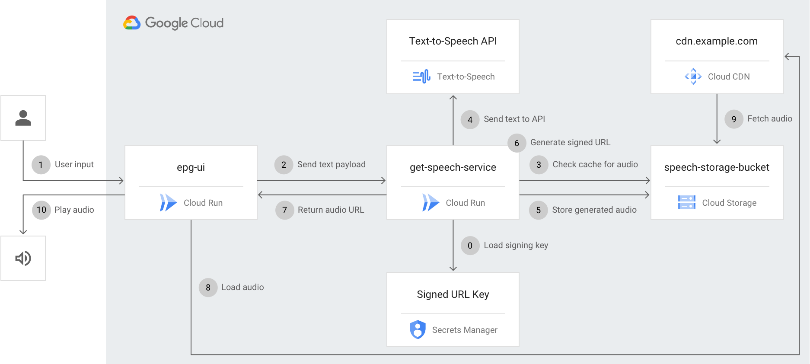

# Google Cloud Text-to-Speech EPG Demo

This repository contains a reference implementation demonstrating how the [Google Cloud Text-to-Speech Service](https://cloud.google.com/text-to-speech) can be used to easily implement text-to-speech functionality for Electronic Program Guides (EPG's). This is particularly relevant due to new [Ofcom guidance](https://www.ofcom.org.uk/__data/assets/pdf_file/0042/196989/epg-accessibility-report-2020.pdf) that mandates that EPG's must offer text-to-speech functionality in order to meet customers accessibility requirements.

This repository contains two supporting components that augment the [Google Cloud Text-to-Speech Service](https://cloud.google.com/text-to-speech) to deliver a reference implementation and demo for the EPG use-case. These components, alongside the utilised Google Cloud Services make it possible to deliver a highly performant, and extremely cost effective implementation of text-to-speech for EPG's and other similar use cases.

A hosted version of this demo is available [here](https://epg.epg-text-to-speech.demos.maynard.io).

**Note:** This is not an officially supported Google product

| Component                     | Source                                                 |    Description  |
|---                            |---                                                     |---              |
| **get-speech-service**            | [get-speech-service/](get-speech-service/)             | The **get-speech-service** is a web service written in Golang that is responsible for handling requests for speech synthesis.  Clients send a POST request to the `/getSpeech` endpoint containing the text that needs to be synthesised, alongside some [additional configuration parameters](get-speech-service/README.md#request).  The **get-speech-service** then sends the text from the request to the [Google Cloud Text-to-Speech Service](https://cloud.google.com/text-to-speech) and saves the resulting audio file in [Google Cloud Storage](https://cloud.google.com/storage).  Finally, a time-bound [Signed URL](https://cloud.google.com/cdn/docs/using-signed-urls) is generated for the resulting audio file which is returned to the client to be played to the user.  On each request, the **get-speech-service** also checks if synthesised audio for the requested text payload (and associated configuration) already exists. If so, a new [Signed URL](https://cloud.google.com/cdn/docs/using-signed-urls) it is immediately generated and returned to the client for the existing file, avoiding the need to re-synthesise the audio. This has significant performance benefits and provides cost savings.               |
| epg-ui                        | [epg-ui/](epg-ui/)                                     | The epg-ui is an extremely simple static website that is used for emulating an EPG for demo purposes. It provides a mock EPG where users can click elements. Some lightweight JavaScript then calls the **get-speech-service** to fetch an URL for the synthesised audio, which is then played back to the user.                |

## Architecture

This demo makes use of the following Google Cloud Services:
* **[Text-to-Speech](https://cloud.google.com/text-to-speech):** Used for synthesising text to audio. 
* **[Cloud Run](https://cloud.google.com/run)**: Used for hosting the **get-speech-service** and **epg-ui**.
* **[Cloud Storage](https://cloud.google.com/storage)**: Used for storage of the synthesised speech audio.
* **[Cloud CDN](https://cloud.google.com/cdn)**: Content delivery network used for delivering synthesised speech audio.
* **[Secrets Manager](https://cloud.google.com/secret-manager)**: Used for storing the [signing key](https://cloud.google.com/cdn/docs/private-content#how_urls_are_signed) for Cloud CDN to provide secure, time bound URL's for accessing synthesised audio.

The below diagram illustrates how the components communicate:

| Step                          | Explanation                                                                                                                                                                    |
|---                            |---                                                                                                                                                                             |
| 0                             | When the **get-speech-service** starts, it makes a call to [Secrets Manager](https://cloud.google.com/secret-manager) and loads the [Cloud CDN signing key](https://cloud.google.com/cdn/docs/private-content#how_urls_are_signed) for later use to provide secure, time bound URL's for accessing synthesised audio.   
| 1                             | A user clicks an item to be spoken on the **epg-ui** (or real life client such as a set-top box).                                                                                                                                                    |
| 2                             | The **epg-ui** (or real life client such as a set-top box) sends a POST request to the **get-speech-service** containing a JSON payload which contains the text to be synthesised, alongside optional configuration parameters.                                                                                                                                                                                                                                                                            |
| 3                             | The **get-speech-service** generates a hash of the text to be synthesised, and any optional configuration passed with the request. It checks to see if there is already a synthesised audio file in GCS Bucket.                                      |
| 4                             | If there is no existing synthsised audio file in the GCS Bucket, the **get-speech-service** sends the text to the [Text-to-Speech](https://cloud.google.com/text-to-speech) Service to be synthesised.                                               |
| 5                             | The **get-speech-service** writes the synthesised audio from the [Text-to-Speech](https://cloud.google.com/text-to-speech) Service to the GCS Bucket.                                                                                                |
| 6                             | (Not shown on diagram) The **get-speech-service** generates a [Signed URL](https://cloud.google.com/cdn/docs/using-signed-urls) to provide secure, time bound access to the synthesised audio.                                                                                                                                                                                                                                                                                 |
| 7                             | The **get-speech-service** returns a response to the **epg-ui** (or alternate consuming client) containing a Cloud CDN [Signed URL](https://cloud.google.com/cdn/docs/using-signed-urls) that provides access to the synthesised audio.                                                                                                                                                                                                                                                                                 |
| 8                             | The **epg-ui** (or alternate consuming client) loads the audio file from Cloud CDN, if the file is not already in cache then Cloud CDN will fetch it from the GCS Bucket and cache for future requests.                                              |
| 9                             | The **epg-ui** plays the synthesised audio to the user.                                                                                                                                                                                |

For more information on these components see the [get-speech-service](get-speech-service/) and [epg-ui](epg-ui/) instructions.

## Deployment

Deployment instructions are contained within the component directories. See the [get-speech-service instructions](get-speech-service/) and [epg-ui instructions](epg-ui/).

## Notes
* The current architecture provides a highly performant sample implementation, performance could be further improved by making the following changes:
  * **Pre-Process Audio:** The call to the [Text-to-Speech Service](https://cloud.google.com/text-to-speech) is the slowest step in the request process. Performance could be significantly improved by pre-processing the EPG content. The simplest implementation would be a batch job that makes a request to the **get-speech-service** with all of the EPG content. This would cause all future requests to be served from the cache.
  * **Redis / Memcached Cache Index:** Currently the **get-speech-service** checks the GCS Bucket on every request to determine if the synthesised audio already exists. This adds around ~50ms of latency. Keeping an index of already synthesised audio in [Cloud Memorystore](https://cloud.google.com/memorystore) would reduce this latency.
  * **Cache get-speech-service Requests:** Additional caching could be implemented to cache responses to the POST requests made to the `/getSpeech` endpoint.