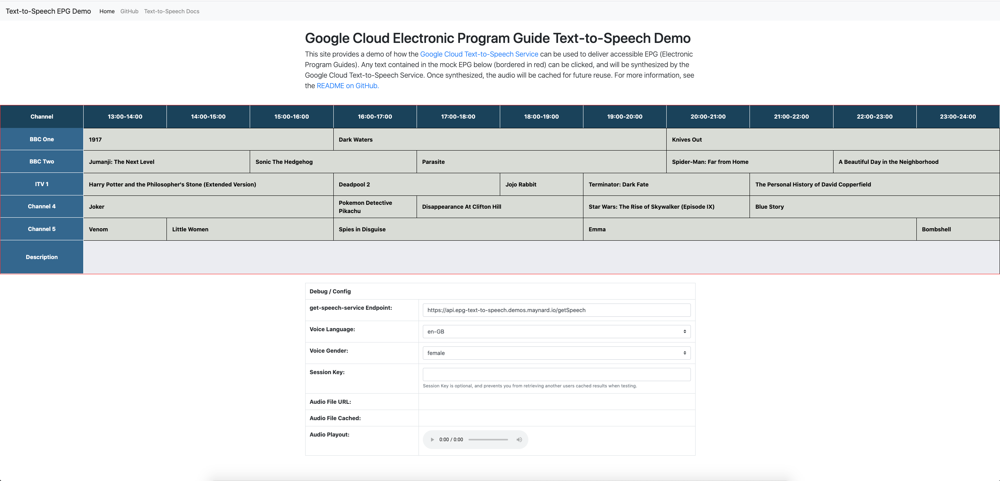

# epg-ui

The epg-ui is an extremely simple static website that is used for emulating an EPG for demo purposes. It provides a mock EPG where users can click elements. Some lightweight JavaScript then calls the **epg-ui** to fetch an URL for the synthesised audio, which is then played back to the user.



# Customising EPG Content
The EPG is pre-populated with random movies sourced from Google Play Movies. The content shown in the EPG can be changed by editing the [src/epg-items.json](src/epg-items.json) file. This file should contain exactly 23 `epgItems`.

# Customising Default get-speech-service API URL
The get-speech-service API URL can be changed on the epg-ui directly. To change the default value, you should edit the following line in [src/index.html](src/index.html):
```html
<input type="text" id="get-speech-service-api-endpoint" value="https://api.epg-text-to-speech.demos.maynard.io/getSpeech" class="form-control" id="session-key">
```
This will be made a configurable environment variable in the future.

# Deployment

Continuous deployment can be set up through [Cloud Build](https://cloud.google.com/cloud-build). A sample [cloudbuild.yaml](cloudbuild.yaml) file can be found in this directory. See [here](https://cloud.google.com/cloud-build/docs/automating-builds/create-manage-triggers) for instructions on how to set up a Build Trigger.

## Requirements
* These instructions assume that you are using a Bash Shell, and that you have [gcloud](https://cloud.google.com/sdk/install) installed and authenticated.

## Deployment Instructions

### Setup Environment

1. Set variables:
```
PROJECT_ID=<PROJECT_ID>
CLOUD_RUN_REGION=<REGION>
```

<details><summary>Variable Explanation</summary>
<p>

| Variable                     | Description                                                                                                                                                                             |
| ---------------------------  |------------------------------------------------------------------------------------------------------------------------------------------------------------------------------------     |
| PROJECT_ID                   | The Google Cloud Project ID to deploy the resources in.                                                                                                                                 |
| CLOUD_RUN_REGION             | The region to deploy the Cloud Run Services in (see: [Cloud Run locations](https://cloud.google.com/run/docs/locations)).                                                               |


</p>
</details>

2. Set gcloud project and additional variables:
```
glcoud config set project ${PROJECT_ID}
PROJECT_NUMBER=$(gcloud projects describe ${PROJECT_ID} --format="value(projectNumber)")
```

### Enable Required Google API's
```
gcloud services enable compute.googleapis.com cloudbuild.googleapis.com run.googleapis.com containerregistry.googleapis.com
```

### Build the epg-ui Container and Store in Google Container Registry

Do not complete this step if setting up a local development environment

```
gcloud builds submit --tag gcr.io/${PROJECT_ID}/epg-ui:latest .
```

### Create a Service Account for the epg-ui
```
gcloud iam service-accounts create epg-ui-sa  --description="Service Account for the epg-ui"
```

### Deploy epg-ui to Cloud Run

Do not complete this step if setting up a local development environment

1. Run the following command (tweak config as appropriate. See [gcloud run deploy docs](https://cloud.google.com/sdk/gcloud/reference/run/deploy))
```
gcloud run deploy epg-ui \
  --image=gcr.io/${PROJECT_ID}/epg-ui:latest \
  --region=${CLOUD_RUN_REGION} \
  --port=80
  --platform=managed \
  --concurrency=80 \
  --cpu=2 \
  --memory=1Gi \
  --timeout=20s \
  --max-instances=100 \
  --service-account=epg-ui-sa@$PROJECT_ID.iam.gserviceaccount.com \
  --allow-unauthenticated
```

### Optional: Grant Cloud Build Permissions
1. Grant Cloud Build permissions to deploy to Cloud Run, and to use the required Service Accounts.
```
gcloud projects add-iam-policy-binding $PROJECT_ID --member serviceAccount:$PROJECT_NUMBER@cloudbuild.gserviceaccount.com --role='roles/run.admin'
gcloud iam service-accounts add-iam-policy-binding $PROJECT_NUMBER-compute@developer.gserviceaccount.com  --member="serviceAccount:$PROJECT_NUMBER@cloudbuild.gserviceaccount.com" --role='roles/iam.serviceAccountUser'
gcloud iam service-accounts add-iam-policy-binding epg-ui-sa@$PROJECT_ID.iam.gserviceaccount.com  --member="serviceAccount:$PROJECT_NUMBER@cloudbuild.gserviceaccount.com" --role='roles/iam.serviceAccountUser'
```

### Optional: Create Build Trigger
See [here](https://cloud.google.com/cloud-build/docs/automating-builds/create-manage-triggers)

### Optional: Create Custom Domain Mapping for epg-ui
1. Set Environment
```
EPG_UI_FQDN=<FQDN>
```
<details><summary>Variable Explanation</summary>
<p>

| Variable                     | Description                                                                                                                                                                            |
| ---------------------------  |--------------------------------------------------------------------------------------------------------------                                                                          |
| EPG_UI_FQDN      | The custom URL you want to use for the epg-ui Cloud Run Service (e.g. `epg-ui.demos.maynard.io`)                                                               |

</p>
</details>

2. Create Domain Mapping
```
gcloud beta run domain-mappings create --service epg-ui --domain ${EPG_UI_FQDN} --platform=managed --region=${CLOUD_RUN_REGION}
```

3. Login to your DNS provider, and create a DNS record as described in the above command output

4. Monitor the status of the Domain Mapping
```
gcloud beta run domain-mappings list --platform=managed --region=${CLOUD_RUN_REGION}
```

# Developing Locally

Developing locally requires [docker-compose](https://docs.docker.com/compose/install/).

A [docker-compose.yml](docker-compose.yml) file is included in this directory to simplify the configuration when testing locally. You should create a separate development project in Google Cloud and follow all of the steps above, with the exception of deploying the image to Cloud Run. Once complete, perform the following steps for local development.

### Build and Run Container
```
docker-compose build && docker-compose up -d
```

### Check Container Status
```
docker-compose ps
```

### Access Local Environment
1. Visit https://localhost:8009
